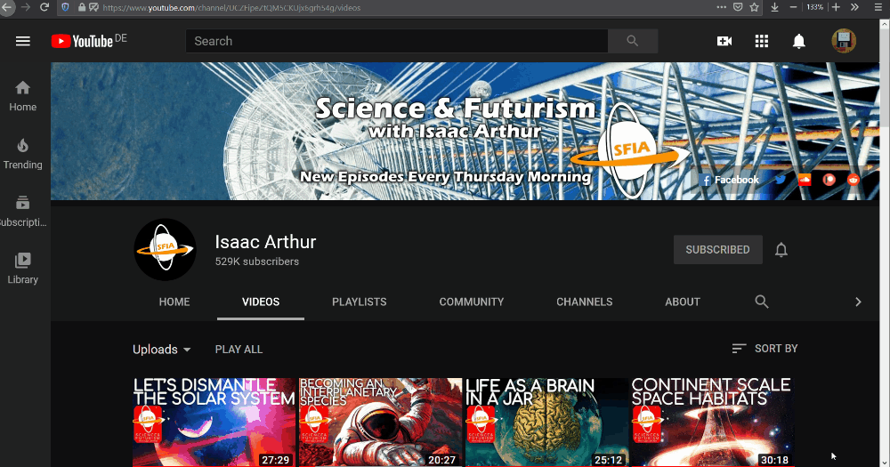
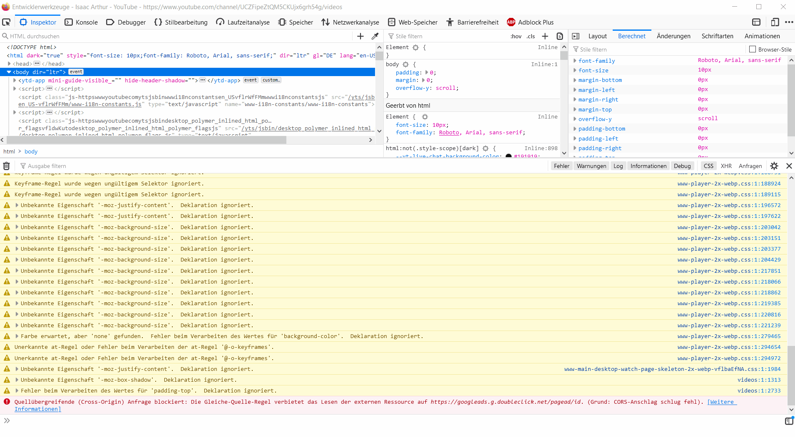

# YouTube Downloader

Download all the videos of a YouTube channel.

## Requirements

For installing the needed Python libraries, open a console window in the project directory and type:

```
pip3 install -r requirements.txt
```

Additionally, the tool [FFmpeg](https://ffmpeg.org/) is needed. The tool expects the command `ffmpeg` in the system path.

## Usage

Before the download, a JSON file with all videos to download is needed. To obtain this JSON file, following steps have to be performed:

1. Open a YouTube channel, navigate to the tab "Videos" and scroll to the very bottom of this page to make all videos visible

   

1. Open the developer console by pressing Ctrl+Shift+I.

1. Copy the code snippet below, put it in the console window and press Enter.

   

   ```js
   console.log(JSON.stringify([...document.getElementsByClassName("yt-simple-endpoint")]
       .filter(e => e.id === "video-title")
       .map(e => ({
           title: e.title,
           link: e.href,
       }))))
   ```

1. Do a right click at the output of the developer console and click on "Copy object" to get the JSON text.

1. Add a file, named "videos.json" in the project directory and put that JSON text inside.

1. After this preparation the download can be started by typing the following command:

   ```
   ./ytdl.py output_dir
   ```

### Why so complicated?

The only way to access YouTube via an API is to use a Google cloud account and this has problems:

1. Any user would need his/her own API key to use the tool
1. This is not a use case one would want to use the official Google cloud credentials
1. Besides of the above mentioned problems, there is a limit of 500 videos that are listed at maximum as mentioned in the comments of [this StackOverflow answer](https://stackoverflow.com/a/20795628/13949398).

So basically, I implemented an ugly workaround that works for me at least🙂
